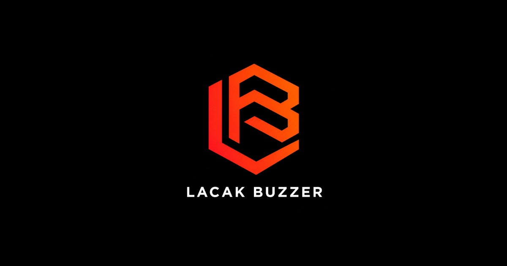
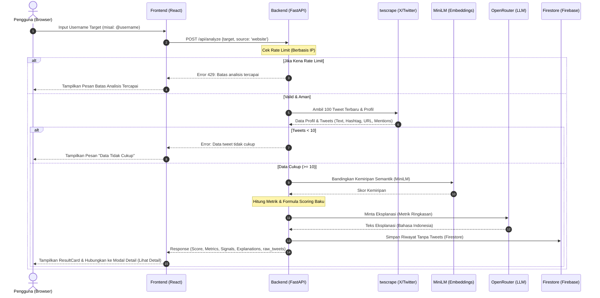
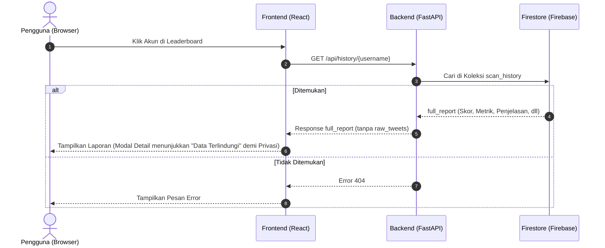

# Lacak Buzzer




## Daftar Isi
- [Deskripsi Proyek](#deskripsi-proyek)
- [Anggota Kelompok](#anggota-kelompok)
- [Detail Tech Stack](#detail-tech-stack)
- [Arsitektur Sistem & Alur Request (Workflows)](#arsitektur-sistem--alur-request-workflows)
  - [Arsitektur Sistem](#arsitektur-sistem)
  - [Diagram Alur Analisis Baru (Request Flow)](#diagram-alur-analisis-baru-request-flow)
  - [Diagram Alur Mengambil Riwayat (History Flow)](#diagram-alur-mengambil-riwayat-history-flow)
- [Struktur Proyek](#struktur-proyek)
- [Tabel Keamanan (Security Table)](#tabel-keamanan-security-table)
- [Instalasi & Cara Menjalankan](#instalasi--cara-menjalankan)
- [Status X Bot & Contoh Respon](#status-x-bot--contoh-respon)
- [Catatan Keamanan](#catatan-keamanan)

---

## Deskripsi Proyek
**Lacak Buzzer** adalah sistem *Minimum Viable Product* (MVP) ringan yang menganalisis profil dan aktivitas akun X/Twitter untuk memberikan **Indikator Risiko Amplifikasi Terkoordinasi**. Sistem ini memperkirakan pola perilaku seperti repetisi, intensitas aktivitas, dan interaksi tanpa mengklaim akun tersebut palsu, berbayar, atau berafiliasi secara definitif.

## Anggota Kelompok
| Nama | Tugas (Backend/Frontend) |
|---|---|
| [Ridwan](https://github.com/Yogs4R) | Backend 1 |
| [Dandy](https://github.com/dandy63609) | Backend 2 |
| [Naufal](https://github.com/naufalid755) | Frontend 1 |
| [Falen](https://github.com/luckywtrike-rgb) | Frontend 2 |

## Detail Tech Stack

### 1. Frontend
*   **React.js (v18)**: Framework utama untuk pembuatan Single Page Application (SPA).
*   **Vite**: Alat build super cepat untuk manajemen aset dan *hot module replacement* (HMR).
*   **CSS Kustom / Tailwind CSS**: Desain visual responsif, premium, dan gelap (dark mode) dengan transisi halus.
*   **Cloudflare Pages**: Media hosting statis untuk frontend.

### 2. Backend (API)
*   **Python (v3.12)**: Bahasa pemrograman utama backend.
*   **FastAPI**: Framework web asinkron dengan performa tinggi yang menyediakan endpoint REST API.
*   **Uvicorn**: Server web ASGI untuk menjalankan FastAPI.
*   **Hugging Face Spaces**: Platform hosting backend menggunakan kontainer Docker.

### 3. Layanan Pihak Ketiga & ML Lokal
*   **Firebase Firestore**: Database dokumen NoSQL untuk menyimpan statistik global dan riwayat pemindaian (`scan_history`).
*   **twscrape**: Kakas scraping data X/Twitter secara terprogram tanpa API X resmi.
*   **all-MiniLM-L6-v2**: Model Sentence-Transformers lokal untuk memproses kemiripan semantik antar-tweet.
*   **OpenRouter (LLM)**: Model AI eksternal untuk menyusun eksplanasi perilaku dalam Bahasa Indonesia secara ramah dan terstruktur.

---

## Arsitektur Sistem & Alur Request (Workflows)

### Arsitektur Sistem
Aplikasi ini berjalan secara terpisah (*decoupled*):
*   **Frontend Client** terhubung ke **FastAPI Backend** via HTTP/HTTPS.
*   Backend menggunakan penyimpanan lokal untuk rate-limiting metadata (stateless JSON files) dan terhubung ke **Firebase Firestore** untuk leaderboard.
*   Backend memanggil model AI lokal untuk semantik, dan **OpenRouter API** untuk eksplanasi teks.

### Diagram Alur Analisis Baru (Request Flow)
Berikut adalah visualisasi alur request ketika pengguna melakukan analisis akun baru:



### Diagram Alur Mengambil Riwayat (History Flow)
Berikut adalah alur saat pengguna mengeklik akun dari papan Leaderboard (tanpa scraping ulang):



---

## Struktur Proyek

```text
lacak-buzzer/
├── .github/
│   ├── changelog-config.json         # Konfigurasi kategori changelog otomatis
│   └── workflows/
│       ├── auto-release.yml          # Workflow Github Action untuk rilis versi
│       └── advanced-security.yml     # Pemindaian Gitleaks (Secrets) & Trivy (Container)
├── frontend/                         # Website SPA (React + Vite)
│   ├── public/
│   │   ├── metadata.json             # Meta data aplikasi
│   │   ├── robots.txt                # Aturan indexing mesin pencari
│   │   ├── sitemap.xml               # Peta situs pencarian
│   │   └── _headers                  # Aturan CSP dan header keamanan (Cloudflare)
│   ├── src/
│   │   ├── components/
│   │   │   ├── Footer.jsx            # Komponen catatan/disclaimer footer
│   │   │   ├── Header.jsx            # Komponen navigasi atas
│   │   │   ├── ResultCard.jsx        # Komponen penampil hasil skor risiko + detail modal
│   │   │   ├── SearchBar.jsx         # Komponen pencarian username
│   │   │   └── TweetDetailsModal.jsx # Pop-up rincian tweet & metrik detail (See Details)
│   │   ├── pages/
│   │   │   └── Home.jsx              # Halaman utama Lacak Buzzer dengan Skeleton Loaders
│   │   ├── App.jsx                   # Root komponen UI
│   │   ├── index.css                 # Global CSS (Tailwind directives)
│   │   └── main.jsx                  # Entry point aplikasi React
│   ├── index.html                    # Kerangka HTML utama
│   ├── package.json                  # Dependensi library NPM Node.js
│   ├── postcss.config.js             # Konfigurasi postcss (Tailwind)
│   ├── tailwind.config.js            # Konfigurasi Tailwind CSS
│   ├── vite.config.js                # Konfigurasi Vite bundler
│   └── wrangler.toml                 # Konfigurasi Cloudflare Pages
├── backend/                          # Backend API & Bot (FastAPI)
│   ├── api/
│   │   ├── analyze.py                # Endpoint `/analyze` FastAPI
│   │   └── leaderboard.py            # Endpoint stats, leaderboard, & detail history
│   ├── bot/
│   │   ├── mention_parser.py         # Ekstraktor username dari teks tweet bot
│   │   └── x_bot.py                  # Proses monitoring dan membalas tweet (Bot X)
│   ├── data/                         # Folder internal data (e.g. rate limit JSON)
│   ├── schemas/
│   │   └── analysis.py               # Schema validasi pydantic (Model Data)
│   ├── services/
│   │   ├── explanation.py            # Generator penjelasan via OpenRouter LLM
│   │   ├── feature_extraction.py     # Logika metrik hashtag, dll (NLP/Math)
│   │   ├── firebase_service.py       # Integrasi database Firestore & global stats
│   │   ├── rate_limits.py            # Pengecekan limit akses harian
│   │   ├── scoring.py                # Implementasi formula penilaian baku
│   │   └── scraper.py                # Wrapper twscrape untuk mengambil tweets
│   ├── tests/
│   │   ├── test_analyze_api.py       # Unit test endpoint analyze dan leaderboard
│   │   ├── test_bot_mentions.py      # Unit test parser mention bot
│   │   ├── test_confidence.py        # Unit test kalkulasi kepercayaan
│   │   ├── test_firebase_service.py  # Unit test integrasi Firebase Firestore
│   │   ├── test_rate_limits.py       # Unit test rate limiter
│   │   └── test_scoring.py           # Unit test algoritma scoring & reducers
│   ├── Dockerfile                    # Konfigurasi container Hugging Face Spaces
│   ├── main.py                       # Entry point ASGI FastAPI (Uvicorn)
│   └── requirements.txt              # Daftar pustaka Python backend
├── docs/                             # Dokumen progres dan manajerial
│   └── PROGRESS.md                   # Pelacakan status rilis MVP
├── AGENTS.md                         # Dokumen PRD / Panduan agen AI proyek
├── BRAND_RESOURCES.md                # Panduan identitas visual & copywriting
├── DESIGN.md                         # Spesifikasi teknis desain & UI komponen
├── DESIGN_RESEARCH.md                # Logika riset desain (ATM Method)
├── .env.example                      # Template variabel environment rahasia
├── .gitignore                        # Daftar file yang diabaikan Git
└── Procfile                          # Konfigurasi perintah runner production
```

---

## Tabel Keamanan (Security Table)

Berikut adalah mekanisme keamanan yang diterapkan pada proyek Lacak Buzzer untuk menjamin integritas data dan proteksi sistem:

| Fitur / Komponen | Ancaman / Risiko | Solusi & Mekanisme Proteksi |
|:---|:---|:---|
| **Kredensial API & Firebase** | Kebocoran kunci otentikasi di repositori publik | Kredensial disimpan dalam `.env` dan `backend/secrets/` — keduanya diabaikan melalui `.gitignore`. Pipeline GitHub Actions dilengkapi dengan **Gitleaks** untuk menyaring kebocoran rahasia secara otomatis. |
| **Docker Container** | Celah keamanan (vulnerabilities) sistem operasi di _image_ | Integrasi **Trivy Image Scanner** pada CI workflow untuk memindai OS/library di backend. Direktori `data/` berjalan dengan izin `755` (bukan `777`) untuk membatasi akses write hanya pada proses aplikasi. |
| **Stateless Tweets** | Pelanggaran privasi / memori server penuh | **Raw tweets** tidak disimpan ke Firestore maupun dikirim ke LLM OpenRouter. Data hanya hidup sementara di memori selama kalkulasi, lalu langsung dibersihkan. |
| **Rate Limiting — Website** | Pengurasan kuota token OpenRouter & Scraping (DDOS) | Rate limiting lokal berbasis IP: maks 5 permintaan sukses per menit per IP. Menggunakan `X-Forwarded-For` header untuk membaca IP klien yang sesungguhnya di balik reverse proxy (Hugging Face). |
| **Rate Limiting — Bot X** | Spam analisis & duplikasi mention | Tiga lapis limit bot: maks 10 reply global/menit, maks 5 request per requester/menit, maks 1 analisis per target/menit. Operasi baca-tulis file JSON dilindungi **threading.Lock** untuk mencegah _race condition_ pada concurrent requests. |
| **Validasi Input Username** | Injeksi karakter aneh / input tak terbatas | Setiap username divalidasi dengan regex `[A-Za-z0-9_]` dan dibatasi maksimum 50 karakter sebelum diteruskan ke scraper. |
| **Validasi Mention ID (Bot)** | Manipulasi format `mention_id` / DoS pada file JSON | `mention_id` divalidasi sebagai string numerik Twitter (maks 25 digit). List `bot_processed_mentions` dibatasi maksimum 500 entri terakhir agar file tidak tumbuh tak terbatas. |
| **Privasi Log ke Firestore** | Penyimpanan IP address pengguna secara permanen di database | Identifier (IP/username requester) dihapus dari execution logs sebelum disimpan ke Firestore. |
| **CORS** | Akses API dari domain tidak sah | `allow_origins` di-whitelist secara eksplisit. Method dibatasi hanya `GET` & `POST`, header dibatasi hanya `Content-Type` & `Authorization`. |
| **Manipulasi Skor** | Penilaian bias atau salah diagnosis | Penerapan logika **Anti-False-Positive Reducers** secara permanen. Pengurangan skor otomatis jika variansi semantik tinggi, total tweet harian kecil, atau aktivitas interaksi minim. |
| **Bot Polling Backoff** | Rate limit ban dari Twitter akibat polling agresif saat error | Bot menerapkan **exponential backoff** saat terjadi error polling: jeda berlipat ganda per error (1× → 2× → 4× → 8×) dan reset kembali ke normal setelah berhasil. |
| **Dependency Pinning** | Pembaruan library tak terduga yang membawa breaking changes atau CVE baru | Semua dependency Python di-pin ke versi spesifik di `requirements.txt`. **Dependabot** dikonfigurasi untuk membuka PR otomatis setiap ada versi terbaru (setiap Senin). |

---

## Instalasi & Cara Menjalankan

### Panduan Kolaborasi
Bagi anggota kelompok yang baru bergabung, ikuti langkah-langkah berikut:

1. **Clone Repositori**
   ```bash
   git clone https://github.com/Yogs4R/lacak-buzzer.git
   cd lacak-buzzer
   ```

2. **Alur Kerja Git (2 Opsi)**

   **Opsi A: Simple Workflow (Pemula)**
   Gunakan alur ini jika tidak ingin pusing dengan *branching*.
   - Siapkan perubahan: `git add .`
   - Simpan perubahan: `git commit -m "pesan singkat tentang fitur/perbaikan"`
   - Ambil *update* teman: `git pull origin main`
   - Unggah pekerjaan: `git push origin main`

   **Opsi B: Advanced Workflow (Standar Industri)**
   Gunakan alur ini jika sudah terbiasa dengan Git.
   - Ambil *update* terbaru: `git pull origin main`
   - Buat *branch* fitur: `git checkout -b nama-tugas`
   - Simpan perubahan: `git add .` lalu `git commit -m "feat: nama tugas"`
   - Unggah & gabungkan: `git push origin nama-tugas` lalu buat *Pull Request* di GitHub.

### Backend (API)

**Langkah 1: Setup Awal (Cukup dilakukan sekali)**
Buka PowerShell, lalu jalankan perintah berikut untuk membuat *virtual environment* menggunakan Python 3.12 (Jangan lupa download python versi 3.12 di [python.org](https://www.python.org/downloads/)):
```powershell
cd backend
py -3.12 -m venv venv
```
*(Jika perintah `py` tidak dikenali, Anda bisa menggunakan `python -m venv venv` asalkan versi Python Anda adalah 3.12).*

**Langkah 2: Menjalankan Backend (Dilakukan setiap kali ingin menjalankan API)**
Buka PowerShell, lalu jalankan perintah berikut secara berurutan:
```powershell
cd backend
# Aktifkan virtual environment
.\venv\Scripts\Activate.ps1

# Install atau perbarui dependensi
pip install -r requirements.txt

# Jalankan server API
uvicorn main:app --reload
```

**Keluar dari Virtual Environment**
Jika sudah selesai dan ingin menonaktifkan *virtual environment*, ketik perintah berikut di terminal:
```powershell
deactivate
```

### Frontend (Website)
```bash
cd frontend
npm install
npm run dev
```

## Status X Bot & Contoh Respon

> [!NOTE]
> **Status X Bot Saat Ini: AKTIF / ENABLED**  
> Menggunakan kombinasi `twscrape` dan `twikit` dengan injeksi *cookies* dari variabel environment JSON, Bot X ini dapat berjalan 100% gratis tanpa perlu berlangganan API X (Pay-Per-Use).

### Format Respon X Bot
Jika bot diaktifkan secara mandiri dengan kredensial *cookies* yang valid, format balasan otomatis di Twitter/X adalah sebagai berikut:

```text
Risiko: Tinggi | Skor: 74/100

- Kemiripan pesan cukup tinggi
- Pola penggunaan tagar terlihat padat

⚠️ Indikator pola perilaku, bukan bukti koordinasi.
```
*Catatan: Bot X membatasi panjang teks agar ketat berada di bawah batas 280 karakter Twitter/X dengan pemotongan otomatis.*

## Catatan Keamanan
*Skor yang dihasilkan adalah indikator risiko berbasis pola perilaku, bukan bukti bahwa akun tersebut terkoordinasi, palsu, dibayar, atau memiliki niat tertentu.*
