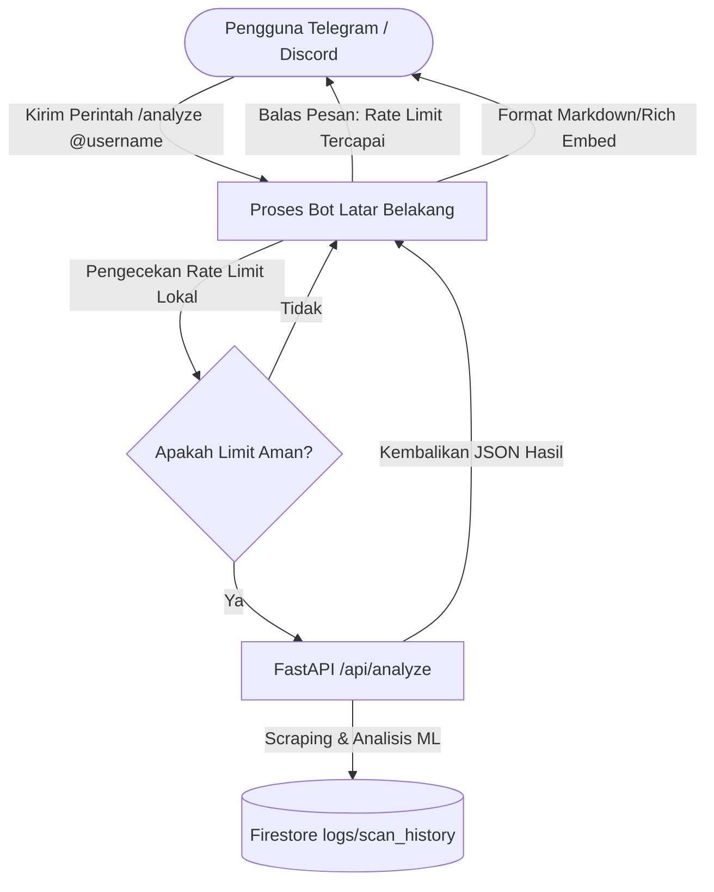

# Rencana Implementasi: Alternatif Bot Telegram/Discord (Lacak Buzzer)

Dokumen ini berisi rencana implementasi taktis untuk menggantikan Bot X/Twitter dengan **Telegram Bot** atau **Discord Bot** sebagai platform interaktif alternatif. Langkah ini diusulkan untuk mengatasi kendala kebijakan komersialisasi baru X API per Februari 2026 (penghapusan Free Tier dan kewajiban Pay-Per-Use).

---

## 1. Perbandingan Keuntungan Alternatif Bot

| Parameter | Twitter/X Bot (Nonaktif) | Telegram Bot (Rekomendasi) | Discord Bot |
|---|---|---|---|
| **Biaya API** | Berbayar (Pay-Per-Use) | **Gratis 100% Selamanya** | **Gratis 100% Selamanya** |
| **Batas Karakter** | 280 karakter (sangat ketat) | **4.096 karakter** (sangat longgar) | **2.000 karakter** (longgar) |
| **Kemudahan Pembuatan** | Sulit (Butuh review 24 jam & kartu kredit) | **Sangat Mudah** (Instan via @BotFather) | **Mudah** (via Discord Developer Portal) |
| **Kemampuan Menampilkan Hasil** | Terbatas (Tanpa penjelasan AI) | **Lengkap** (Bisa menampilkan semua metrik + AI explanation) | **Lengkap** (Bisa format Rich Embed yang indah + AI explanation) |
| **Model Polling/Webhook** | Polling via twscrape + write Tweepy | Long-polling ringan atau Webhook gratis | WebSocket gateway (`discord.py`) |

---

## 2. Rencana Arsitektur & Alur Sistem

Baik Telegram maupun Discord akan bertindak sebagai **klien antarmuka** yang memanggil endpoint backend yang sama, yaitu `/api/analyze` di FastAPI.



---

## 3. Desain Implementasi: Telegram Bot (Pilihan Utama)

Telegram Bot adalah alternatif terbaik karena proses pembuatannya instan dan interaksinya sangat cepat melalui perangkat mobile.

### A. Langkah Pembuatan Bot Telegram (1 Menit)
1. Buka aplikasi Telegram, cari akun **`@BotFather`** (bot resmi Telegram).
2. Kirim perintah `/newbot`.
3. Masukkan nama bot (misal: `Lacak Buzzer Bot`) dan username bot (misal: `lacak_buzzer_bot`).
4. `@BotFather` akan memberikan **HTTP API Bot Token** (simpan di `.env` sebagai `TELEGRAM_BOT_TOKEN`).

### B. Library Python yang Digunakan
Tambahkan library `pyTelegramBotAPI` (ringan dan bertipe sinkron/asinkron) ke `requirements.txt`:
```text
pyTelegramBotAPI==4.15.0
```

### C. Alur Penggunaan (User Experience)
*   **Trigger Command:** `/analyze <username>` atau `/lacak <username>`.
*   **Contoh:** `/analyze jokowi` (tanpa `@` atau dengan `@`).

### D. Mockup Draft Respon Telegram (Format Rich Markdown)
Karena Telegram mendukung 4.096 karakter dan format Markdown, bot dapat membalas dengan visualisasi yang jauh lebih detail dibanding Bot X:

```text
📊 *HASIL PEMINDAIAN AKUN X*
Target: @jokowi
Tingkat Kepercayaan: Normal

🔴 *Indikator Risiko Amplifikasi Terkoordinasi: 74/100 (Tinggi)*

🔍 *Rincian Metrik Perilaku:*
• Kemiripan Semantik (Repetisi): 82%
• Kepadatan Tagar: 70%
• Intensitas Aktivitas Posting: 65%
• Rasio Tautan & Media: 45%
• Pola Interaksi (Mention/Reply): 80%
• Usia & Risiko Kelengkapan Profil: 70%
• Keteraturan Waktu Posting: 50%

💡 *Penjelasan Analisis (AI):*
Akun menunjukkan pola interaksi dan kemiripan narasi yang cukup tinggi di antara postingannya, serta pola waktu postingan yang relatif teratur yang mengindikasikan adanya manajemen konten terjadwal.

⚠️ _Catatan: Skor ini adalah indikator risiko berbasis pola perilaku, bukan bukti bahwa akun tersebut terkoordinasi, palsu, dibayar, atau memiliki niat tertentu._
```

---

## 4. Desain Implementasi: Discord Bot (Pilihan Alternatif)

Discord Bot sangat cocok jika kelompok Anda ingin melakukan demo pada server komunitas Discord dengan visualisasi yang mewah menggunakan *Discord Embeds*.

### A. Langkah Pembuatan
1. Masuk ke [Discord Developer Portal](https://discord.com/developers/applications).
2. Klik **New Application**, beri nama aplikasi.
3. Masuk ke tab **Bot**, klik **Add Bot**.
4. Aktifkan **Message Content Intent** di bawah halaman pengaturan Bot agar bot dapat membaca pesan chat.
5. Salin Token Bot tersebut ke `.env` sebagai `DISCORD_BOT_TOKEN`.

### B. Library Python yang Digunakan
```text
discord.py==2.3.2
```

### C. Alur Penggunaan
*   Slash command: `/analyze target:<username>`

---

## 5. Rencana Perubahan Kode Backend (Lifespan Task)

Sama seperti bot X, bot Telegram atau Discord ini akan berjalan sebagai background task di [backend/main.py](file:///e:/project-coding/lacak-buzzer/backend/main.py):

```python
# Di dalam lifespan main.py
telegram_token = os.getenv("TELEGRAM_BOT_TOKEN")
if telegram_token:
    import asyncio
    from bot.telegram_bot import start_telegram_bot
    asyncio.create_task(start_telegram_bot(telegram_token))
    print("🤖 [Startup] Bot Telegram aktif di latar belakang.")
```

Ini memastikan aplikasi tetap berjalan satu pintu di Hugging Face Spaces tanpa memerlukan konfigurasi infrastruktur VPS tambahan.
